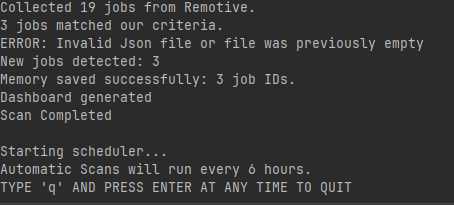
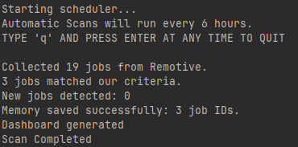
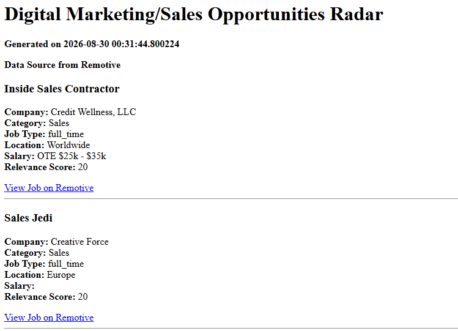
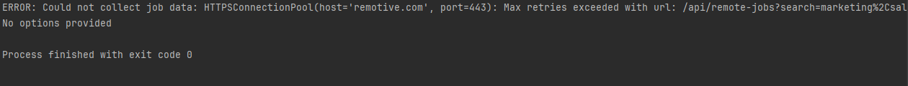

# Marketing & Sales Opportunity Radar
## Project Overview
The Marketing & Sales Opportunity Radar is a Python automation tool that
collects remote job opportunities from the Remotive API. 

It focuses on two areas:
- Marketing
- Sales

The project is designed to help entry-level to mid-level candidates find
relevant remote opportunities without having to manually search through
large numbers of unrelated job listings.

The program collects job data, filters out irrelevant and overly senior
positions, ranks the remaining opportunities, detects newly discovered jobs,
generates an HTML dashboard and can be run on a schedule

## Problem Being Solved

Searching through remote job websites can produce many irrelevant results,
This project automates the process of finding more relevant Marketing and
Sales opportunities.

## Data Source

The project uses the Remotive Remote Jobs API.

The API provides the job information used by the program, including details
such as:

- Job title
- Company
- Category
- Job type
- Required location
- Salary information
- Job description
- Job URL
- Job ID

The program processes the API response rather than using manually created
job data.

### Keywords

The system searches for jobs related to: 

- marketing
- digital marketing
- social media
- SEO
- content marketing
- advertising
- sales

### Excluded positions

The system attempts to remove clearly unrelated jobs such as:

- Software
- Developer
- Engineer
- Technical Writer
- Data Scientist
- Devops
- Frontend
- Backend 
- Writer
- Reviewer
- Editor

The system also excludes obvious senior or executive positions such as:

- Senior
- Sr.
- Lead
- Director
- Head 
- Vice President
- V.P
- Chief
- Executive
- Principal
- Manager

### Relevance scoring

Jobs receive a relevance score based on factors such as:

- Internship status
- Worldwide location

Higher-scoring opportunities appear first on the dashboard.

## Persistent Memory

The project uses a JSON file to remember job IDs from previous scans.

The memory file is: 

    job_memory.json

During a scan, the program:

1. Loads previously seen job IDs.
2. Collects the latest jobs.
3. Compares the current job IDs with the previous IDs.
4. Identifies jobs that have not been seen before.
5. Marks those jobs as NEW.
6. Saves the current IDs for the next scan.

This allows the system to detect newly discovered opportunities across
different program executions.

## Scheduling

APScheduler is used to automate repeated scans.

The scheduler runs the opportunity scan every 6 hours.

The scheduled process runs:

    main()

## HTML Dashboard

The program generates:

    GeneratedOutput.html

The dashboard displays:

- Generation timestamp
- Job title
- Company
- Category
- Job type
- Location
- Salary
- Relevance score
- Link to the original job listing

## Project Structure

    AI-Opportunity-Radar/
    │
    ├── main.py
    ├── My-Scheduler.py
    ├── job_memory.py
    ├── requirements.txt
    ├── README.md
    │──GeneratedOutput.html
    ├── data/
        └── job_memory.json

### main.py

Contains the main workflow, API collection, filtering, ranking, and
dashboard generation.

### job_memory.py

Handles persistent JSON memory and detection of newly discovered jobs.

### My-Scheduler.py

Uses APScheduler to run the main opportunity scan automatically.
Enter q to stop the scheduler

### job_memory.json

Stores job IDs from previous scans.

### GeneratedOutput.html

Contains the generated HTML dashboard.

## Installation

Clone the repository and open the project directory.

Create and activate a Python virtual environment if needed.

Install the required dependencies with:

    pip install -r requirements.txt

The main dependencies are:

    requests
    apscheduler

## Evidence

### First run:

### Second run:

### Dashboard:

### Connection Failure

## Limitations

There are more jobs that can be accessed in the remotive website, 
but these jobs require paying a subscription. So this program can only 
target the easily accessed free jobs. 

## Future Improvement

Possible improvements include:

- Email notifications for new opportunities
- More advanced ranking
- Additional job categories
- A more interactive dashboard
- Tracking changes to existing job listings

## Conclusion

The Marketing & Sales Opportunity Radar demonstrates how a Python
automation system can collect real job data, filter and rank opportunities,
remember previous results, detect new opportunities, and repeatedly run
without requiring the user to manually perform every search.